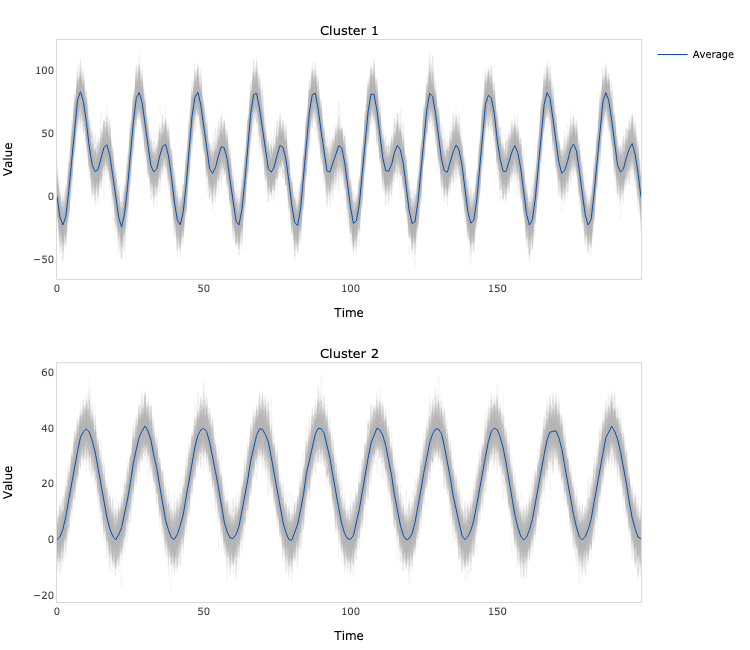

# USRL-MTS PyTorch


PyTorch implementation of unsupervised causal convolutional network encoder with triplet loss for time series representation 
learning introduced in Franceschi, J.Y., Dieuleveut, A. and Jaggi, M., 2019. Unsupervised scalable representation learning for 
multivariate time series. *Advances in neural information processing systems*, 32. 
Adapted from the [official code repository](https://github.com/White-Link/UnsupervisedScalableRepresentationLearningTimeSeries).

## Dependencies
```bash
numpy==1.23.5
torch==1.13.1
scikit-learn==1.1.3
plotly==5.11.0
kaleido==0.2.1
```
## Usage
```python
import numpy as np
from sklearn.model_selection import train_test_split
from sklearn.cluster import KMeans

from usrl_mts_pytorch.model import Encoder
from usrl_mts_pytorch.plots import plot

# Generate the data
N = 60   # number of time series
C = 10   # number of dimensions of each time series
L = 100  # number of samples of each time series
x = np.zeros((N, C, L))
t = np.linspace(0, 1, L)
c = np.cos(2 * np.pi * (10 * t - 0.5))
s = np.sin(2 * np.pi * (20 * t - 0.5))
x[:N // 3] = 20 + 20 * c + 5 * np.random.normal(size=(N // 3, C, L))
x[N // 3: 2 * N // 3] = 20 + 20 * s + 5 * np.random.normal(size=(N // 3, C, L))
x[2 * N // 3:] = 20 + 20 * c + 20 * s + 5 * np.random.normal(size=(N // 3, C, L))

# Split the data
x_train, x_test = train_test_split(x, test_size=0.3)

# Fit the encoder
encoder = Encoder(
    x=x_train,
    blocks=2,
    filters=8,
    kernel_size=3,
    encoder_length=5,
    output_length=10,
)

encoder.fit(
    negative_samples=10,
    learning_rate=0.001,
    batch_size=32,
    epochs=100,
    verbose=True
)

# Generate the representations
z_train = encoder.predict(x_train)
z_test = encoder.predict(x_test)

# Fit a clustering algorithm to the representations
kmeans = KMeans(n_clusters=3)
kmeans.fit(z_train)

# Plot the results
fig = plot(x=x_test, y=kmeans.predict(z_test))
fig.write_image('results.png', scale=4, height=900, width=700)
```

