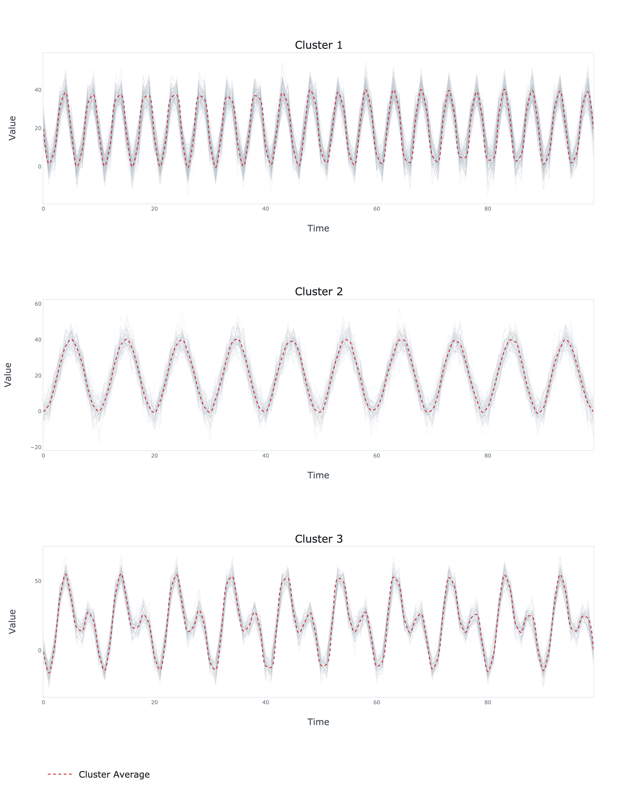

# USRL-MTS PyTorch


PyTorch implementation of unsupervised causal convolutional network encoder with triplet loss for time series representation 
learning introduced in Franceschi, J.Y., Dieuleveut, A. and Jaggi, M., 2019. Unsupervised scalable representation learning for 
multivariate time series. *Advances in neural information processing systems*, 32. [arXiv:1901.10738](https://arxiv.org/abs/1901.10738).

Adapted from: [https://github.com/White-Link/UnsupervisedScalableRepresentationLearningTimeSeries](https://github.com/White-Link/UnsupervisedScalableRepresentationLearningTimeSeries).


## Dependencies
```bash
numpy==1.23.1
torch==1.10.2
scikit-learn==1.1.2
plotly==5.9.0
kaleido==0.2.1
```
## Usage
```python
import numpy as np
from sklearn.cluster import KMeans

from usrl_mts_pytorch.model import Encoder
from usrl_mts_pytorch.plots import plot

# Generate the time series
N = 50   # number of time series
C = 10   # number of dimensions of each time series
L = 200  # number of samples of each time series
x = np.zeros((N, C, L))
t = np.linspace(0, 1, L)
c = np.cos(2 * np.pi * (10 * t - 0.5))
s = np.sin(2 * np.pi * (20 * t - 0.5))
x[:N // 2] = 20 + 20 * c + 5 * np.random.normal(size=(N // 2, C, L))
x[N // 2:] = 30 + 30 * c + 30 * s + 10 * np.random.normal(size=(N // 2, C, L))

# Fit the encoder to the time series
encoder = Encoder(
    x=x,
    blocks=2,
    filters=8,
    kernel_size=3,
    encoder_length=5,
    output_length=10,
)

encoder.fit(
    negative_samples=10,
    learning_rate=0.001,
    batch_size=32,
    epochs=100,
    verbose=True
)

# Generate the representations
z = encoder.predict(x)

# Fit a clustering algorithm to the representations
kmeans = KMeans(n_clusters=2)
kmeans.fit(z)

# Plot the clustering results
fig = plot(x=x, y=kmeans.predict(z))
fig.write_image('results.png', width=750, height=650)
```

